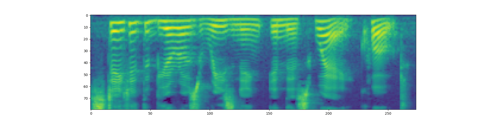
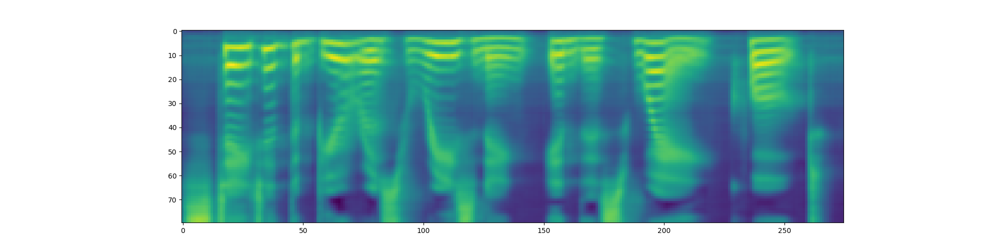

# TTS project

This is an implementation of [Fast Speech paper](https://arxiv.org/abs/1905.09263).

## Installation

The script downloads the necessary resources.

```shell script
./setup.sh
```

Model checkpoint can be downloaded with the following command:
```shell script
gdown --id 1wk7amOThMnfZtoMEKELT399rANOy1ZnN -O best_checkpoint.pth
```

## Results

**IMPORTANT:** I USE PRECOMPUTED ALIGNMENTS

Here are samples of the synthesized speech:

* `A defibrillator is a device that gives a high energy electric shock to the heart of someone who is in cardiac arrest`


* `Massachusetts Institute of Technology may be best known for its math, science and engineering education`


* `Wasserstein distance or Kantorovich Rubinstein metric is a distance function defined between probability distributions on a given metric space`


## Training

The logs can be found in [W&B](https://wandb.ai/ngtvx/tts-hw/runs/3qovc0uj/).

The final model trained for 40 epochs with [this config](./tts_hw/configs/full_config.json). Training took 11 hours and 51 minutes.

## Experiments

### Aligner
The [original aligner](./tts_hw/alignment/grapheme_aligner.py) used durations that were extracted from wav2vec. Since this aligner computed durations in waveform there were problems with rounding during duration modeling. 

I trained model with this aligner for 17 hours in total. The results were not great, but the sentences are mostly legible.

Example:

The sentence is `The Chronicles of Newgate, Volume two. By Arthur Griffiths. Section four: Newgate down to eighteen eighteen.`


The spectrograms are oversmoothed, but you can see some faint patterns in low frequencies which is not bad (upper - original, lower - predicted).


Another [set of alignments](./tts_hw/alignment/precomp_aligner.py) wes taken from an [open-source implementation](https://github.com/xcmyz/FastSpeech). These alignments have the exact same shape as our encoded texts and they were extracted from Tacotron. There were no rounding problems because the alignments were computed in melspectrogram.

Using precomputed alignments greatly boosted the quality. The convergence improved, too. My model was able to reach the same quality as the previous one in under 1 hour.

The examples of audio are provided in the section [Results](#results). 


### Abbreviations
I was surprised to learn that `torchaudio`'s pipelines did not do the expansion. The dataset contains a lot of abbreviations hence the lack of expansion can really affect the loss. 

Another challenge were non-ASCII symbols in the dataset. Dataset's webpage mentions non-ASCII symbols, however there is no information about which symbols they are. Turns out there is a variety of diacritics and umlauts because the dataset contains quotes from languages other than English. I [replace such symbols](./tts_hw/datasets/lj_dataset.py#L58) with their respective ASCII version.

There are also some other symbols that tokenizer does not support. I simply delete such characters.

### Hyperparameters
I took model hyperparameters from FastSpeech paper and I did not change them at all. I mainly experimented with learning rate and various schedulers.

Model achieved good results with OneCycleLR and with [WarmupScheduler](./tts_hw/schedulers/noam.py) from the original Transformer paper. With WarmupScheduler model trained faster, so I picked it as a final model.

The spectrograms look significantly better than the previous example (upper - original, lower - predicted).



