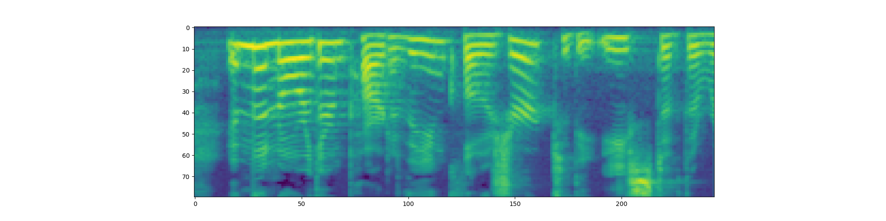
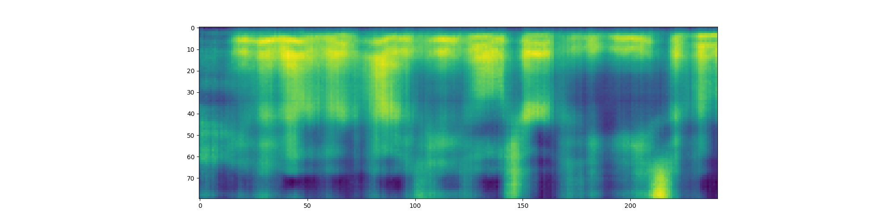

# TTS project

## Installation

The script downloads the necessary resources.

```shell script
./setup.sh
```

Model checkpoint can be downloaded with the following command:
```shell script
gdown --id TODO -O best_checkpoint.pth
```

## Results

Here are samples of the synthesized speech:

* `A defibrillator is a device that gives a high energy electric shock to the heart of someone who is in cardiac arrest`
* `Massachusetts Institute of Technology may be best known for its math, science and engineering education`
* `Wasserstein distance or Kantorovich Rubinstein metric is a distance function defined between probability distributions on a given metric space`

## Training

TODO

## Experiments

### Aligner
The original aligner used durations that were extracted from wav2vec. Since this aligner computed durations in waveform there were problems with rounding during duration modeling. 

I trained model with this aligner for 17 hours in total. The results were not great, but the sentences are mostly legible. I tried training FastSpeech with this aligner with various schedulers without much improvement. 

Example:

The sentence is `The Chronicles of Newgate, Volume two. By Arthur Griffiths. Section four: Newgate down to eighteen eighteen.`


The spectrograms are oversmoothed, but you can see some faint patterns in low frequencies which is not bad (left - original, right - predicted).





Another set of alignments wes taken from an [open-source implementation](https://github.com/xcmyz/FastSpeech). These alignments have the exact same shape as our encoded texts and they were extracted from Tacotron. There were no rounding problems because the alignments were computed in melspectrogram.

Using precomputed alignments greatly boosted the quality. The convergence improved, too. My model was able to reach the same quality as the previous one in under 1 hour.

The examples of audio are provided in the section [Results](#results). 


### Abbreviations
I was really surprised to learn that `torchaudio`'s pipelines did not do the abbreviation expansion.
